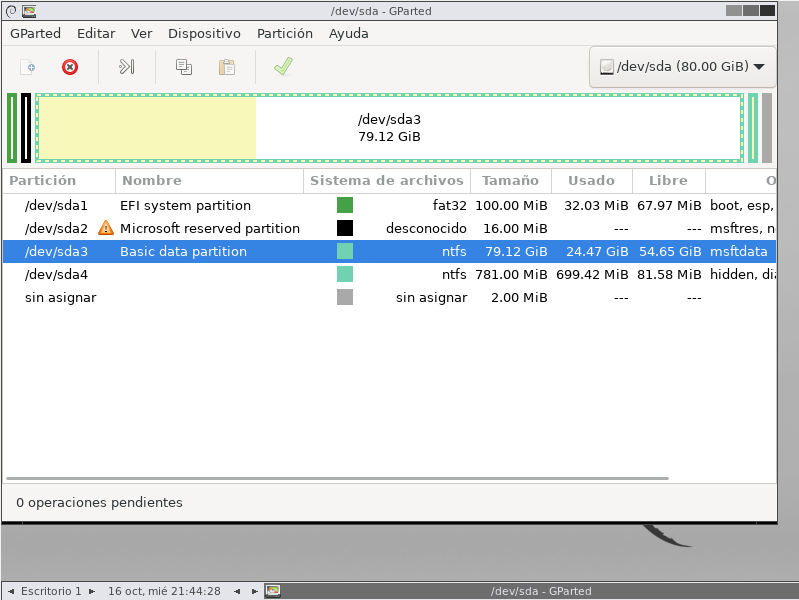
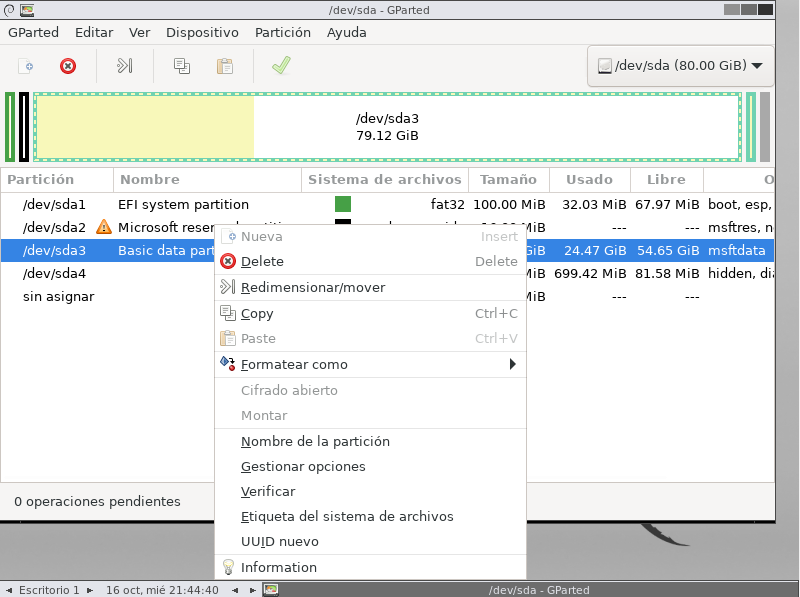
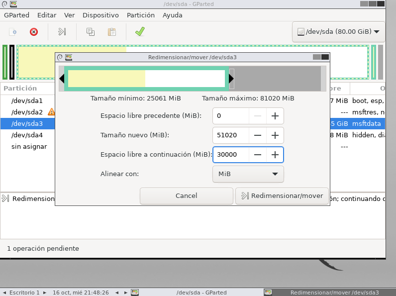
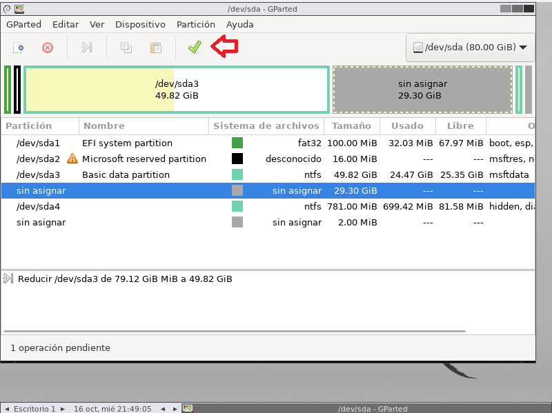
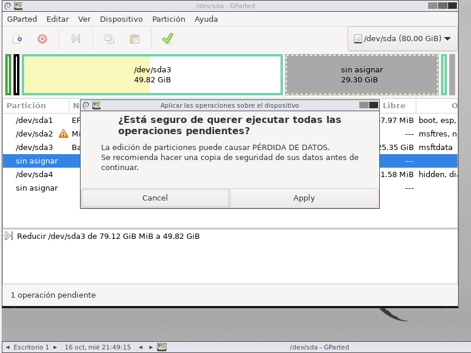
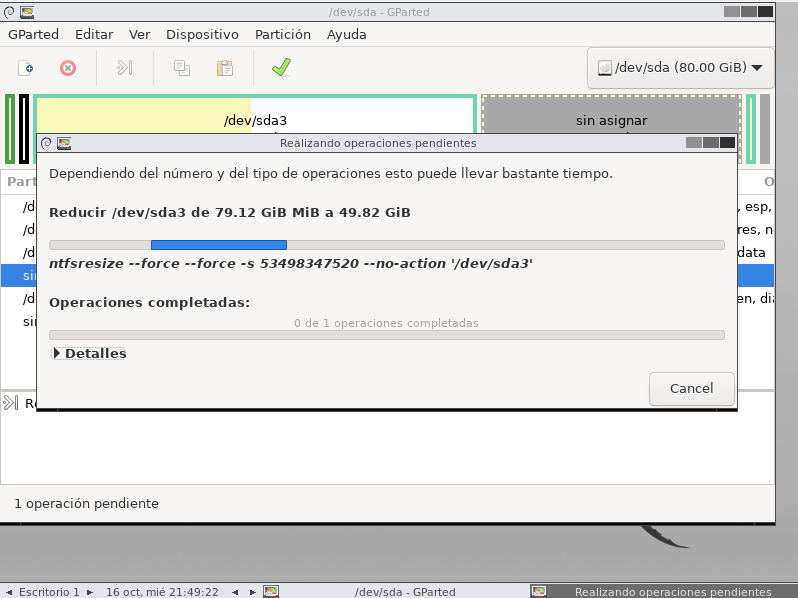
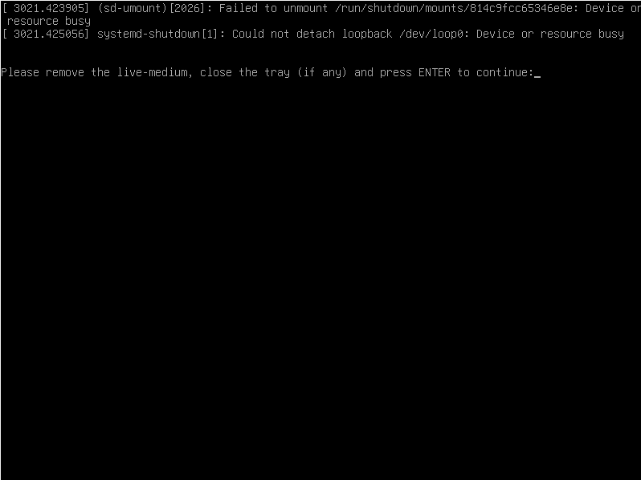

### Asignando memoria a la partición del disco de Windows 11
####

#### Paso 1: Seleccionamos la partición básica.

####
#### Paso 2: Presionamos < Click Derecho > y seleccionamos en "Redimensionar/mover".

####
#### Paso 3: En el apartado nuevo nos aparecerá la memoria asignada.

####
#### Paso 4: Ya que tengo 80GB en dicha máquina, asignaré 50GB en (Tamaño nuevo) que es con lo que se quedará Windows 11 y dejaré libres 30GB para la instalación de Ubuntu. Seleccionamos < Redimensionar/mover >.

####
#### Paso 5: Asi quedarían las particiones creadas.

####
#### Paso 6: Y nos saldrá esta ventana, donde seleccionaremos < Apply >.

####
#### Paso 7: Se empezará a aplicar las configuraciones previas y Salimos de la ventana pulsando el último cuadradito de color negro arriba a la derecha

####
#### Paso 8: Nos saldrá esta nueva interfaz.

####
#### Paso 9: Pulsamos 2 veces consecutivas en el botón rojo llamado < EXIT >. Nos saldrá este nuevo cartel y le daremos a < Shutdown >

####
#### Paso 10: Nos mostrará un cartel diciendo que tenemos que retirar el medio, a lo que escribiremos en pantalla "confirm".

*Volver* [:leftwards_arrow_with_hook:](..)
